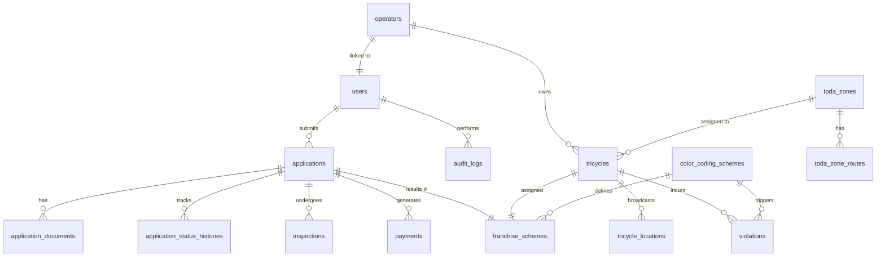

# Trivora — Relational Database Schema Design

> **Stack**: Laravel (PHP) · MySQL/MariaDB via Laragon  
> **Scope**: Tricycle Franchise Application, Document Review, Physical Inspection, Payment, Scheme Issuance, Map Monitoring & Automated Violation Detection

---

## Entity-Relationship Overview



---

## Table Definitions

### 1. `users`
> The unified authentication table for system actors — Tricycle Drivers/Operators, TMO Personnel, BPLO Staff, and System Admins. Role-based access is handled via the `role` column. Note: The municipal treasurer role is not part of Trivora; physical payments are conducted at the municipal cashier counter.

| Column | Type | Constraints | Description |
|--------|------|-------------|-------------|
| `id` | `BIGINT UNSIGNED` | PK, AUTO_INCREMENT | Primary key |
| `name` | `VARCHAR(150)` | NOT NULL | Full name |
| `email` | `VARCHAR(255)` | UNIQUE, NOT NULL | Login email |
| `email_verified_at` | `TIMESTAMP` | NULLABLE | Email verification time |
| `password` | `VARCHAR(255)` | NOT NULL | Hashed password |
| `role` | `ENUM('tricycle_driver','tmo_personnel','bplo_staff','admin')` | NOT NULL, DEFAULT `tricycle_driver` | System role |
| `is_active` | `BOOLEAN` | NOT NULL, DEFAULT `true` | Account status |
| `profile_photo_path` | `VARCHAR(255)` | NULLABLE | Avatar image path |
| `remember_token` | `VARCHAR(100)` | NULLABLE | Laravel remember token |
| `created_at` | `TIMESTAMP` | NULLABLE | — |
| `updated_at` | `TIMESTAMP` | NULLABLE | — |

---

### 2. `operators`
> Extended profile for tricycle operators/drivers. Linked 1-to-1 with `users`.

| Column | Type | Constraints | Description |
|--------|------|-------------|-------------|
| `id` | `BIGINT UNSIGNED` | PK, AUTO_INCREMENT | Primary key |
| `user_id` | `BIGINT UNSIGNED` | FK → `users.id`, UNIQUE, NOT NULL | Linked system user |
| `first_name` | `VARCHAR(100)` | NOT NULL | Given name |
| `middle_name` | `VARCHAR(100)` | NULLABLE | Middle name |
| `last_name` | `VARCHAR(100)` | NOT NULL | Surname |
| `contact_number` | `VARCHAR(20)` | NOT NULL | Mobile/phone number |
| `address` | `TEXT` | NOT NULL | Full home address |
| `barangay` | `VARCHAR(100)` | NOT NULL | Barangay of residence |
| `date_of_birth` | `DATE` | NOT NULL | For age verification |
| `license_number` | `VARCHAR(50)` | UNIQUE, NOT NULL | LTO Driver's License No. |
| `license_expiry_date` | `DATE` | NOT NULL | License expiration |
| `license_restriction_code` | `VARCHAR(20)` | NULLABLE | LTO restriction codes |
| `toda_id` | `BIGINT UNSIGNED` | FK → `toda_zones.id`, NULLABLE | Assigned TODA |
| `created_at` | `TIMESTAMP` | NULLABLE | — |
| `updated_at` | `TIMESTAMP` | NULLABLE | — |

---

### 3. `toda_zones`
> Represents registered Tricycle Operators and Drivers Associations (TODAs) or operational zones within the municipality.

| Column | Type | Constraints | Description |
|--------|------|-------------|-------------|
| `id` | `BIGINT UNSIGNED` | PK, AUTO_INCREMENT | Primary key |
| `name` | `VARCHAR(150)` | NOT NULL | TODA / Zone name |
| `code` | `VARCHAR(20)` | UNIQUE, NOT NULL | Short code (e.g., `TODA-01`) |
| `barangay` | `VARCHAR(100)` | NOT NULL | Barangay coverage |
| `description` | `TEXT` | NULLABLE | Additional details |
| `is_active` | `BOOLEAN` | NOT NULL, DEFAULT `true` | Active status |
| `created_at` | `TIMESTAMP` | NULLABLE | — |
| `updated_at` | `TIMESTAMP` | NULLABLE | — |

---

### 4. `toda_zone_routes`
> Defines the geo-coordinate waypoints that form each TODA zone's route boundary, used for map rendering.

| Column | Type | Constraints | Description |
|--------|------|-------------|-------------|
| `id` | `BIGINT UNSIGNED` | PK, AUTO_INCREMENT | Primary key |
| `toda_zone_id` | `BIGINT UNSIGNED` | FK → `toda_zones.id`, NOT NULL | Parent zone |
| `sequence_order` | `SMALLINT UNSIGNED` | NOT NULL | Point ordering index |
| `latitude` | `DECIMAL(10, 7)` | NOT NULL | Latitude coordinate |
| `longitude` | `DECIMAL(10, 7)` | NOT NULL | Longitude coordinate |
| `created_at` | `TIMESTAMP` | NULLABLE | — |
| `updated_at` | `TIMESTAMP` | NULLABLE | — |

---

### 5. `tricycles`
> Core vehicle record for each registered tricycle unit.

| Column | Type | Constraints | Description |
|--------|------|-------------|-------------|
| `id` | `BIGINT UNSIGNED` | PK, AUTO_INCREMENT | Primary key |
| `operator_id` | `BIGINT UNSIGNED` | FK → `operators.id`, NOT NULL | Owner/operator |
| `toda_zone_id` | `BIGINT UNSIGNED` | FK → `toda_zones.id`, NULLABLE | Assigned TODA zone |
| `plate_number` | `VARCHAR(20)` | UNIQUE, NOT NULL | LTO Plate No. |
| `engine_number` | `VARCHAR(50)` | UNIQUE, NOT NULL | Engine serial No. |
| `chassis_number` | `VARCHAR(50)` | UNIQUE, NOT NULL | Chassis serial No. |
| `make` | `VARCHAR(100)` | NOT NULL | Brand (e.g., Honda, Kawasaki) |
| `model` | `VARCHAR(100)` | NOT NULL | Model name |
| `year_model` | `YEAR` | NOT NULL | Manufacturing year |
| `body_color` | `VARCHAR(50)` | NOT NULL | Body paint color |
| `body_type` | `VARCHAR(100)` | NULLABLE | Body type description |
| `or_number` | `VARCHAR(50)` | NULLABLE | LTO Official Receipt No. |
| `cr_number` | `VARCHAR(50)` | NULLABLE | LTO Certificate of Reg. No. |
| `status` | `ENUM('unregistered','active','suspended','revoked')` | NOT NULL, DEFAULT `unregistered` | Vehicle registration status |
| `created_at` | `TIMESTAMP` | NULLABLE | — |
| `updated_at` | `TIMESTAMP` | NULLABLE | — |

---

### 6. `applications`
> The master record for each franchise application submitted by an operator. Tracks the full 6-phase lifecycle from online submission through physical verification, inspection, cashier payment, BPLO verification, and sticker issuance.

| Column | Type | Constraints | Description |
|--------|------|-------------|-------------|
| `id` | `BIGINT UNSIGNED` | PK, AUTO_INCREMENT | Primary key |
| `reference_number` | `VARCHAR(30)` | UNIQUE, NOT NULL | Human-readable ref (e.g., `APP-2026-00042`) |
| `operator_id` | `BIGINT UNSIGNED` | FK → `operators.id`, NOT NULL | Applying operator |
| `tricycle_id` | `BIGINT UNSIGNED` | FK → `tricycles.id`, NOT NULL | Subject tricycle unit |
| `application_type` | `ENUM('new','renewal','transfer')` | NOT NULL, DEFAULT `new` | Type of franchise application |
| `current_step` | `TINYINT UNSIGNED` | NOT NULL, DEFAULT `1` | Workflow step (1–6) |
| `status` | `VARCHAR(50)` | NOT NULL, DEFAULT `draft` | Current status (`pending_review`, `pending_inspection`, `failed_inspection`, `pending_payment`, `payment_issue`, `payment_verified`, `awaiting_tmo_confirmation`, `completed`, `rejected`, `cancelled`) |
| `sticker_number` | `VARCHAR(50)` | NULLABLE | Official municipal franchise sticker serial number released by BPLO |
| `tracking_method` | `ENUM('mobile_gps','iot_device')` | NULLABLE | GPS tracking method selected by TMO during final confirmation |
| `iot_device_id` | `VARCHAR(50)` | NULLABLE | Physical IoT Tracker hardware serial number issued by TMO |
| `submitted_at` | `TIMESTAMP` | NULLABLE | When the applicant submitted |
| `completed_at` | `TIMESTAMP` | NULLABLE | When fully processed |
| `remarks` | `TEXT` | NULLABLE | General notes from any officer |
| `created_at` | `TIMESTAMP` | NULLABLE | — |
| `updated_at` | `TIMESTAMP` | NULLABLE | — |

---

### 7. `application_documents`
> Stores references to files uploaded as part of an application (OR/CR, license copy, proof of residence, etc.).

| Column | Type | Constraints | Description |
|--------|------|-------------|-------------|
| `id` | `BIGINT UNSIGNED` | PK, AUTO_INCREMENT | Primary key |
| `application_id` | `BIGINT UNSIGNED` | FK → `applications.id`, NOT NULL | Parent application |
| `document_type` | `ENUM('drivers_license','or_cr','proof_of_residence','toda_clearance','photo_id','other')` | NOT NULL | Type of document |
| `file_name` | `VARCHAR(255)` | NOT NULL | Original file name |
| `file_path` | `VARCHAR(500)` | NOT NULL | Storage path |
| `file_size_kb` | `INT UNSIGNED` | NULLABLE | File size in kilobytes |
| `mime_type` | `VARCHAR(100)` | NULLABLE | MIME type (e.g., `application/pdf`) |
| `review_status` | `ENUM('pending','approved','rejected')` | NOT NULL, DEFAULT `pending` | Document-level review result |
| `reviewed_by` | `BIGINT UNSIGNED` | FK → `users.id`, NULLABLE | TMO personnel who reviewed |
| `reviewed_at` | `TIMESTAMP` | NULLABLE | When the review occurred |
| `rejection_reason` | `TEXT` | NULLABLE | Reason if rejected |
| `created_at` | `TIMESTAMP` | NULLABLE | — |
| `updated_at` | `TIMESTAMP` | NULLABLE | — |

---

### 8. `application_status_histories`
> Immutable audit trail of every status change an application goes through.

| Column | Type | Constraints | Description |
|--------|------|-------------|-------------|
| `id` | `BIGINT UNSIGNED` | PK, AUTO_INCREMENT | Primary key |
| `application_id` | `BIGINT UNSIGNED` | FK → `applications.id`, NOT NULL | Subject application |
| `changed_by` | `BIGINT UNSIGNED` | FK → `users.id`, NOT NULL | Actor who triggered the change |
| `from_status` | `VARCHAR(50)` | NULLABLE | Previous status value |
| `to_status` | `VARCHAR(50)` | NOT NULL | New status value |
| `from_step` | `TINYINT UNSIGNED` | NULLABLE | Previous step number |
| `to_step` | `TINYINT UNSIGNED` | NULLABLE | New step number |
| `notes` | `TEXT` | NULLABLE | Officer notes/reason |
| `created_at` | `TIMESTAMP` | NULLABLE | Timestamp of change |

---

### 9. `inspections`
> Records the physical inspection conducted by TMO personnel for each application. Supports multiple re-inspection attempts.

| Column | Type | Constraints | Description |
|--------|------|-------------|-------------|
| `id` | `BIGINT UNSIGNED` | PK, AUTO_INCREMENT | Primary key |
| `application_id` | `BIGINT UNSIGNED` | FK → `applications.id`, NOT NULL | Subject application |
| `inspector_id` | `BIGINT UNSIGNED` | FK → `users.id`, NOT NULL | TMO personnel who inspected |
| `attempt_number` | `TINYINT UNSIGNED` | NOT NULL, DEFAULT `1` | Inspection attempt count |
| `inspection_date` | `DATE` | NOT NULL | Date of inspection |
| `inspection_time` | `TIME` | NULLABLE | Time of inspection |
| `location_address` | `VARCHAR(255)` | NULLABLE | Where inspection took place |
| `result` | `ENUM('passed','failed','pending')` | NOT NULL, DEFAULT `pending` | Overall result |
| `safety_equipment` | `BOOLEAN` | NULLABLE | Safety equipment check |
| `brakes_steering` | `BOOLEAN` | NULLABLE | Brakes & steering check |
| `lights_reflectors` | `BOOLEAN` | NULLABLE | Lights & reflectors check |
| `tires_suspension` | `BOOLEAN` | NULLABLE | Tires & suspension check |
| `emissions_test` | `BOOLEAN` | NULLABLE | Emissions compliance |
| `license_toda_docs` | `BOOLEAN` | NULLABLE | License & TODA documents |
| `inspector_notes` | `TEXT` | NULLABLE | Freeform inspector remarks |
| `created_at` | `TIMESTAMP` | NULLABLE | — |
| `updated_at` | `TIMESTAMP` | NULLABLE | — |

---

### 10. `payments`
> Stores Official Receipt (OR) details from the physical Municipal Cashier payment, verified and recorded by BPLO staff. (Payments are made physically OTC at the Municipal Hall cashier; Trivora does not process online transactions).

| Column | Type | Constraints | Description |
|--------|------|-------------|-------------|
| `id` | `BIGINT UNSIGNED` | PK, AUTO_INCREMENT | Primary key |
| `application_id` | `BIGINT UNSIGNED` | FK → `applications.id`, UNIQUE, NOT NULL | One payment per application |
| `processed_by` | `BIGINT UNSIGNED` | FK → `users.id`, NOT NULL | BPLO staff member who verified the receipt |
| `official_receipt_number` | `VARCHAR(50)` | UNIQUE, NOT NULL | Municipal Cashier OR number |
| `amount` | `DECIMAL(10, 2)` | NOT NULL | Total amount paid (₱750.00 standard municipal fee) |
| `payment_method` | `ENUM('cash','gcash','bank_transfer','check')` | NOT NULL, DEFAULT `cash` | Mode of payment at physical cashier |
| `payment_date` | `DATE` | NOT NULL | Date on the official receipt |
| `payment_time` | `TIME` | NULLABLE | Time of payment |
| `is_verified` | `BOOLEAN` | NOT NULL, DEFAULT `false` | BPLO verification confirmation flag |
| `verified_at` | `TIMESTAMP` | NULLABLE | When verified by BPLO staff |
| `notes` | `TEXT` | NULLABLE | Cashier / BPLO verification remarks |
| `created_at` | `TIMESTAMP` | NULLABLE | — |
| `updated_at` | `TIMESTAMP` | NULLABLE | — |

---

### 11. `color_coding_schemes`
> Master lookup table defining available color codes and the days on which each color is restricted from operating.

| Column | Type | Constraints | Description |
|--------|------|-------------|-------------|
| `id` | `BIGINT UNSIGNED` | PK, AUTO_INCREMENT | Primary key |
| `name` | `VARCHAR(50)` | NOT NULL | Color name (e.g., `Red`, `Blue`) |
| `color_hex` | `VARCHAR(7)` | NOT NULL | Hex code for UI rendering (e.g., `#EF4444`) |
| `restricted_days` | `JSON` | NOT NULL | Array of restricted day names (e.g., `["Monday", "Tuesday"]`) |
| `description` | `TEXT` | NULLABLE | Human-readable rule description |
| `is_active` | `BOOLEAN` | NOT NULL, DEFAULT `true` | Whether this scheme is in use |
| `created_at` | `TIMESTAMP` | NULLABLE | — |
| `updated_at` | `TIMESTAMP` | NULLABLE | — |

---

### 12. `franchise_schemes`
> The official franchise permit record issued by BPLO after cashier receipt verification. Links the tricycle unit to an official body number, smart GPS tracker, and color-coding scheme.

| Column | Type | Constraints | Description |
|--------|------|-------------|-------------|
| `id` | `BIGINT UNSIGNED` | PK, AUTO_INCREMENT | Primary key |
| `application_id` | `BIGINT UNSIGNED` | FK → `applications.id`, UNIQUE, NOT NULL | Source application |
| `tricycle_id` | `BIGINT UNSIGNED` | FK → `tricycles.id`, UNIQUE, NOT NULL | Subject tricycle |
| `color_coding_scheme_id` | `BIGINT UNSIGNED` | FK → `color_coding_schemes.id`, NOT NULL | Assigned color code |
| `issued_by` | `BIGINT UNSIGNED` | FK → `users.id`, NOT NULL | BPLO staff who issued |
| `franchise_number` | `VARCHAR(30)` | UNIQUE, NOT NULL | Official franchise No. / Body No. |
| `sticker_number` | `VARCHAR(50)` | NULLABLE | Official franchise sticker serial number |
| `issue_date` | `DATE` | NOT NULL | Date of issuance |
| `expiry_date` | `DATE` | NOT NULL | Permit expiration date |
| `is_active` | `BOOLEAN` | NOT NULL, DEFAULT `true` | Currently valid flag |
| `notes` | `TEXT` | NULLABLE | BPLO remarks |
| `created_at` | `TIMESTAMP` | NULLABLE | — |
| `updated_at` | `TIMESTAMP` | NULLABLE | — |

---

### 13. `tricycle_locations`
> Time-series table storing GPS location broadcasts from active tricycles. Used for real-time map monitoring.

| Column | Type | Constraints | Description |
|--------|------|-------------|-------------|
| `id` | `BIGINT UNSIGNED` | PK, AUTO_INCREMENT | Primary key |
| `tricycle_id` | `BIGINT UNSIGNED` | FK → `tricycles.id`, NOT NULL, INDEX | Tricycle unit |
| `latitude` | `DECIMAL(10, 7)` | NOT NULL | GPS latitude |
| `longitude` | `DECIMAL(10, 7)` | NOT NULL | GPS longitude |
| `speed_kmh` | `DECIMAL(5, 2)` | NULLABLE | Reported speed |
| `heading_deg` | `SMALLINT UNSIGNED` | NULLABLE | Direction heading (0–360°) |
| `accuracy_m` | `DECIMAL(6, 2)` | NULLABLE | GPS accuracy radius in meters |
| `source` | `ENUM('gps_device','mobile_app','manual')` | NOT NULL, DEFAULT `mobile_app` | Data source |
| `recorded_at` | `TIMESTAMP` | NOT NULL, INDEX | When this location was captured |
| `created_at` | `TIMESTAMP` | NULLABLE | — |

> **Note:** For production, consider partitioning this table by `recorded_at` month or using a time-series database extension, as this table will grow very fast.

---

### 14. `violations`
> Records automated or manual violations detected against a tricycle's color-coding scheme.

| Column | Type | Constraints | Description |
|--------|------|-------------|-------------|
| `id` | `BIGINT UNSIGNED` | PK, AUTO_INCREMENT | Primary key |
| `tricycle_id` | `BIGINT UNSIGNED` | FK → `tricycles.id`, NOT NULL | Offending tricycle |
| `franchise_scheme_id` | `BIGINT UNSIGNED` | FK → `franchise_schemes.id`, NOT NULL | Active franchise at time of violation |
| `color_coding_scheme_id` | `BIGINT UNSIGNED` | FK → `color_coding_schemes.id`, NOT NULL | Violated coding scheme |
| `location_snapshot_id` | `BIGINT UNSIGNED` | FK → `tricycle_locations.id`, NULLABLE | Location record that triggered the flag |
| `detected_by` | `BIGINT UNSIGNED` | FK → `users.id`, NULLABLE | TMO personnel (NULL if system-automated) |
| `violation_type` | `ENUM('color_coding','route_violation','expired_franchise','other')` | NOT NULL | Category of violation |
| `detected_at` | `TIMESTAMP` | NOT NULL | When the violation was detected |
| `day_of_week` | `ENUM('Monday','Tuesday','Wednesday','Thursday','Friday','Saturday','Sunday')` | NOT NULL | Day of detection |
| `detection_method` | `ENUM('automated','manual')` | NOT NULL, DEFAULT `automated` | How it was flagged |
| `status` | `ENUM('open','acknowledged','contested','resolved','dismissed')` | NOT NULL, DEFAULT `open` | Violation lifecycle status |
| `fine_amount` | `DECIMAL(10, 2)` | NULLABLE | Monetary penalty if applicable |
| `fine_paid_at` | `TIMESTAMP` | NULLABLE | When fine was settled |
| `notes` | `TEXT` | NULLABLE | Officer notes or contestation details |
| `created_at` | `TIMESTAMP` | NULLABLE | — |
| `updated_at` | `TIMESTAMP` | NULLABLE | — |

---

### 15. `audit_logs`
> System-wide immutable log of all significant user actions for accountability and traceability.

| Column | Type | Constraints | Description |
|--------|------|-------------|-------------|
| `id` | `BIGINT UNSIGNED` | PK, AUTO_INCREMENT | Primary key |
| `user_id` | `BIGINT UNSIGNED` | FK → `users.id`, NULLABLE | Actor (NULL for system events) |
| `event` | `VARCHAR(100)` | NOT NULL | Action name (e.g., `application.submitted`) |
| `auditable_type` | `VARCHAR(100)` | NULLABLE | Polymorphic model class |
| `auditable_id` | `BIGINT UNSIGNED` | NULLABLE | ID of the affected record |
| `old_values` | `JSON` | NULLABLE | State before change |
| `new_values` | `JSON` | NULLABLE | State after change |
| `ip_address` | `VARCHAR(45)` | NULLABLE | Requester IP address |
| `user_agent` | `TEXT` | NULLABLE | Browser/client info |
| `created_at` | `TIMESTAMP` | NULLABLE | When the event occurred |

---

## Relationship Summary

| Relationship | Type | Description |
|---|---|---|
| `users` → `operators` | **One-to-One** | Every driver/operator account has one extended profile |
| `operators` → `tricycles` | **One-to-Many** | One operator may own multiple tricycle units |
| `operators` → `applications` | **One-to-Many** | One operator can submit multiple applications (renewals, etc.) |
| `tricycles` → `applications` | **One-to-Many** | A tricycle can have multiple applications over its lifetime |
| `applications` → `application_documents` | **One-to-Many** | Each application bundles multiple uploaded files |
| `applications` → `application_status_histories` | **One-to-Many** | Full immutable timeline of status changes per application |
| `applications` → `inspections` | **One-to-Many** | Multiple inspection attempts are allowed per application |
| `applications` → `payments` | **One-to-One** | Exactly one payment record is created per approved application |
| `applications` → `franchise_schemes` | **One-to-One** | A successful application produces exactly one franchise permit |
| `color_coding_schemes` → `franchise_schemes` | **One-to-Many** | Multiple franchises can share the same color code |
| `franchise_schemes` → `tricycles` | **One-to-One** | An active tricycle holds exactly one current franchise |
| `tricycles` → `tricycle_locations` | **One-to-Many** | Each tricycle continuously logs many location pings |
| `tricycles` → `violations` | **One-to-Many** | A tricycle can accumulate multiple violations over time |
| `toda_zones` → `operators` | **One-to-Many** | A TODA zone has many member operators |
| `toda_zones` → `toda_zone_routes` | **One-to-Many** | A zone's geographic boundary is made up of many waypoints |

---

## Workflow Step → Table Mapping

```
Step 1 — Online Driver Registration         → applications (INSERT: 'pending_review')
                                             + application_documents (INSERT: 'pending')
Step 2 — TMO Document Review                → application_documents (UPDATE: 'approved'/'rejected')
                                             → applications.status → 'pending_inspection' (UPDATE)
Step 3 — TMO Physical Tricycle Inspection   → inspections (INSERT: 'passed'/'failed')
         (Payment Ticket Issued on Pass)    → applications.status → 'pending_payment' (UPDATE)
Step 4 — Physical Municipal Cashier Payment → Driver pays ₱750 cash OTC at Municipal Hall
         (Over-the-Counter Physical Cashier) (Receives validated Payment Ticket + Official Receipt)
Step 5 — Submission to BPLO Counter         → Driver submits validated ticket & Official Receipt
Step 6 — BPLO Cashier Payment Verification  → payments (INSERT: OR#, date, amount, processed_by)
                                             → applications.status → 'payment_verified' (UPDATE)
Step 7 — BPLO Sticker Release for Coding    → applications.sticker_number (UPDATE)
         (BPLO does NOT issue IoT device)   → franchise_schemes (INSERT: franchise_number, sticker_number, is_active=false)
                                             → applications.status → 'awaiting_tmo_confirmation' (UPDATE)
Step 8 — Driver Returns to TMO Counter      → TMO verifies signed ticket, BPLO approval & sticker
Step 9 — TMO Tracking Setup & Activation    → applications.tracking_method (UPDATE: 'mobile_gps' or 'iot_device')
         (Mobile GPS or IoT Device Issued)  → applications.iot_device_id & tricycles.iot_device_id (UPDATE if IoT)
                                             → tricycles.status → 'active' (UPDATE)
                                             → franchise_schemes.is_active → true (UPDATE)
                                             → applications.status → 'completed' (UPDATE)

Monitoring & Enforcement:
Step 10 — Map Monitoring                    → tricycle_locations (continuous GPS stream via IoT or Driver App)
Step 11 — Auto-Violation                    → violations (automated INSERT when location is
                                              detected on restricted day per color_coding_schemes)
```

---

## Recommended Indexes

```sql
-- Fast lookup of operator's applications
CREATE INDEX idx_applications_operator ON applications(operator_id, status);

-- Fast lookup of tricycle's location history
CREATE INDEX idx_locations_tricycle_time ON tricycle_locations(tricycle_id, recorded_at DESC);

-- Fast violation detection query
CREATE INDEX idx_violations_tricycle_status ON violations(tricycle_id, status, detected_at);

-- Franchise lookup by tricycle
CREATE UNIQUE INDEX idx_franchise_tricycle ON franchise_schemes(tricycle_id, is_active);

-- Audit log polymorphic lookup
CREATE INDEX idx_audit_morphable ON audit_logs(auditable_type, auditable_id);
```
