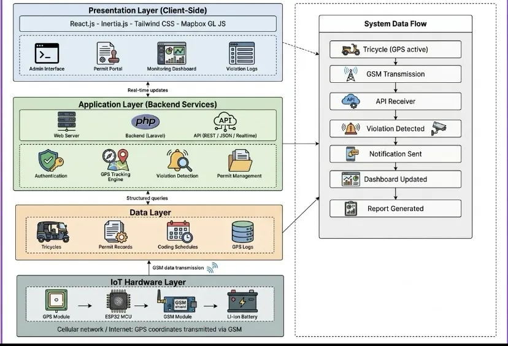

# 🛵 Trivora — Municipal Tricycle Regulatory & Fleet Monitoring Information System

> A comprehensive, real-time web platform for municipal tricycle franchise governance, physical inspection queues, automated color-coding enforcement, payment processing, and GPS telematics fleet tracking.

---

## 👥 Group Information

* **Project Title:** Trivora: Municipal Tricycle Regulatory & Fleet Monitoring Information System
* **Course / Defense:** Capstone Project
* **Team Members:**
  * **John Aldrie Baquiran** — Lead System Architect & Full-Stack Web Developer
  * **Jessen Salaysay** — Mobile App Backend & Hardware Integration
  * **Aeron Cedric Ortega** — QA Analyst
  * **Eman Esguerra** — UI/UX Designer (Mobile App)

---

## 📖 1. Introduction & Summary

### 1.1 Purpose
The primary objective of **Trivora** is to modernize and streamline the Motorized Tricycle Operator's Permit (MTOP) issuance process and fleet governance for Local Government Units (LGUs). By replacing slow, paper-based workflows with a unified digital platform, Trivora connects municipal departments—including the **Traffic Management Office (TMO)**, **Business Permits & Licensing Office (BPLO)**, and **Municipal Treasurer’s Office**—with registered tricycle operators. Additionally, the system provides real-time GPS fleet tracking and automated color-coding enforcement to maintain public safety, regulate TODA route zones, and eliminate illegal ("colorum") tricycle operations.

### 1.2 Scope
* **In-Scope:**
  * **Public & Operator MTOP Registration**: Online multi-step application wizard for franchise registration, tricycle information, and document submission (OR/CR, LTO Driver's License, Barangay Clearance).
  * **LGU Department Workflow Pipeline**: Multi-stage application state machine: TMO Document Review $\rightarrow$ TMO Physical Safety Inspection $\rightarrow$ Municipal Treasurer Payment & Receipting $\rightarrow$ BPLO Franchise License & Plate Issuance.
  * **TMO Real-Time Map Command Center**: Interactive GIS map rendering live tricycle locations, active TODA zone route polygons, vehicle status indicators, and violation alerts.
  * **Automated Color-Coding Enforcement Engine**: Daily automated rule engine enforcing municipal color-coding schemes based on plate/body number ending digits.
  * **Violation & Citation Management**: Automated violation logging, citation creation, penalty calculation, and payment settlement tracking.
  * **Driver / Operator Portal**: Dedicated dashboard for tricycle owners to monitor application progress, view assigned TODA routes, track unit GPS telematics, and pay violation citations online.

* **Out-of-Scope (for Defense Phase):**
  * Hardware production deployment on physical active vehicles (simulated via telematics dataset broadcaster and mocked GPS pings).
  * Direct LTO API database integration (handled via driver document uploads and manual TMO document verification).
  * Live banking/e-wallet API integration (simulated via uploaded electronic receipts and cashier verification).

### 1.3 Definitions, Acronyms, and Abbreviations
* **MTOP**: Motorized Tricycle Operator's Permit — Official franchise license issued by LGUs granting authorization to operate a public tricycle within municipal boundaries.
* **TMO**: Traffic Management Office — LGU department responsible for physical safety inspections, traffic regulation, and TODA compliance.
* **BPLO**: Business Permits & Licensing Office — LGU department responsible for final franchise authorization, license record management, and plate issuance.
* **TODA**: Tricycle Operators and Drivers Association — Recognized organization of tricycle operators assigned to specific route zones.
* **LGU**: Local Government Unit — Municipal government unit managing local transport compliance.
* **OR/CR**: Official Receipt / Certificate of Registration — Official vehicle ownership documents issued by the Land Transportation Office (LTO).
* **GPS**: Global Positioning System — Telematics technology providing real-time geographical coordinates.
* **IoT**: Internet of Things — Hardware modules (e.g., ESP32, SIM800L) embedded in vehicles to transmit location telematics.
* **REST**: Representational State Transfer — Architectural style for stateless network communication APIs.
* **Sanctum**: Laravel Sanctum authentication middleware for secure API tokens and SPA sessions.

---

## 🏗️ 2. Overall Description & Architecture

### 2.1 System Architecture Overview

Trivora is engineered as a decoupled, multi-tier system connecting hardware telematics sensors, a Laravel 12 REST/Inertia backend, a MySQL database, and dynamic React 18 web dashboards.

<p align="center">
  
</p>

### 2.2 Component Interconnection Explanation

1. **Hardware & Telematics Layer**: 
   Vehicle telematics modules (or simulated background telemetry nodes) capture location coordinates (`latitude`, `longitude`), vehicle speed (`speed_kmh`), heading direction (`heading_deg`), and module battery level. This telemetry payload is transmitted via HTTP REST requests or WebSockets into the backend location ingest endpoint (`tricycle_locations`).
2. **Backend Application Layer (Laravel 12)**:
   Serves as the core business logic engine. It manages multi-role authentication via Laravel Sanctum, executes the 4-stage MTOP application pipeline, calculates daily color-coding restrictions based on body number digits, processes violation penalties, and calculates spatial route overlaps for TODA zones.
3. **Database Layer (MySQL 8.0)**:
   Houses normalized relational data across 15 core tables (including `users`, `operators`, `tricycles`, `toda_zones`, `applications`, `inspections`, `payments`, `violations`, and `tricycle_locations`).
4. **Frontend Layer (React 18, Inertia.js, Tailwind CSS)**:
   Renders role-tailored administrative user interfaces without multi-page reloads. Uses **Leaflet & Mapbox GL** to render live map overlays of active units, route boundaries, and color-coding compliance alerts in real time.

---

## ✅ 3. Specific Requirements & Implementation Status

> **Defense Implementation Coverage: >85%** of core functional requirements fully built and operational.

### 3.1 Functional Features (Currently Working)

* **Multi-Role Authentication & Access Control**:
  * Role-based access control (RBAC) supporting Admin, TMO Personnel, BPLO Staff, Municipal Treasurer, and Tricycle Drivers/Operators.
* **Public & Operator MTOP Registration Wizard**:
  * 5-step interactive application wizard supporting operator profiles, tricycle unit details, TODA association selection, and document upload management (OR/CR, LTO Driver's License, Barangay Clearance).
* **TMO Phase 1 — Document Review Queue**:
  * Administrative queue for TMO personnel to inspect submitted documents, issue requests for document corrections, or approve applications for physical inspection.
* **TMO Phase 2 — Physical Safety Inspection Queue & Form Checklist**:
  * Digital physical safety inspection checklist verifying vehicle roadworthiness (brakes, lights, sidecar structure, emissions, body number verification) with document previews and pass/fail forwarding.
* **Municipal Treasurer Payment Processing & Receipts**:
  * Cashier portal managing pending payments, automated fee calculation (MTOP franchise fee, inspection fee, violation fines), payment verification, and official receipt (OR) generation.
* **BPLO Franchise & Plate Issuance Queue**:
  * BPLO release queue for body number assignment, MTOP validity period confirmation, digital franchise certificate issuance, and master registry tracking.
* **TMO Real-Time Fleet Map Command Center**:
  * Interactive GIS map (Leaflet / Mapbox GL) displaying active tricycle locations, live driver stats, TODA zone overlays, and compliance status indicators.
* **Automated Color-Coding Enforcement Engine**:
  * Automated daily restriction calculation based on body number ending digits (e.g., Monday: 1-2, Tuesday: 3-4, Wednesday: 5-6, Thursday: 7-8, Friday: 9-0). Units active on restricted days are automatically flagged as non-compliant on the TMO map command center.
* **Violation Management & Citation System**:
  * Violation ticket issuance, penalty fee computation, tracking of unresolved citations, and direct integration with the Treasurer payment workflow.
* **Driver / Operator Portal & Fleet Dashboard**:
  * Dedicated portal for tricycle owners to track application progress, view live GPS unit coordinates on a interactive route map, review assigned TODA zones, and settle violation citations.

### 3.2 Connected APIs & Protocols

* **Inertia.js Protocol**: Connects Laravel backend controllers directly with React frontend pages without requiring a separate standalone API build.
* **Leaflet & Mapbox GL Tiles API**: Integrated for rendering spatial vector maps, TODA zone route polygons, and dynamic map markers.
* **Laravel Sanctum Auth Protocol**: Guards REST API endpoints for secure token-based access.
* **PDF & Document Preview Engine**: Generates inline HTML/Canvas previews for inspection checklists, OR/CR documents, and official receipts.

### 3.3 Hardware Sensors & Simulated Components (Mocked for Defense)

For the defense presentation, physical hardware components are mocked and simulated to demonstrate complete real-time system capabilities:
* **Mocked GPS Telematics Tracker**: Simulated ESP32/SIM800L cellular tracker pushing latitude/longitude telemetry into `tricycle_locations` database records.
* **Mocked Battery Telemetry Sensor**: Simulated hardware sensor reporting module battery level (e.g., `92%`, `100%`) and telemetry freshness (`iotBattery` telemetry field).
* **Mocked RFID / NFC Tag Scanner**: Simulated handheld scanner reader for instant roadside driver license verification.
* **Mocked E-Wallet Payment Gateway**: Simulated transaction approval for online GCash/Maya payment checkouts.

---

## 🛠️ 4. Prerequisites & Installation

### Prerequisites

- **PHP 8.2+** - [Download](https://www.php.net/downloads)
- **Composer** - [Download](https://getcomposer.org/download/)
- **Node.js 18+** - [Download](https://nodejs.org/)
- **npm** or **yarn** - Comes with Node.js
- **MySQL 8.0+** - [Download](https://www.mysql.com/downloads/)
- **Git** - [Download](https://git-scm.com/)

---

## 🚀 5. Installation & Running the Application

### 1. Clone the Repository

```bash
git clone <repository-url>
cd trivora
```

### 2. Run Setup Command

The easiest way to install all dependencies and set up the project:

```bash
composer run-script setup
```

This will automatically:
- Install PHP dependencies via Composer
- Copy `.env.example` to `.env`
- Generate the application key
- Run database migrations
- Install npm packages
- Build frontend assets

### 3. Configure Environment

Edit the `.env` file with your database credentials:

```env
APP_NAME=Trivora
APP_ENV=local
APP_DEBUG=true
APP_URL=http://localhost

DB_CONNECTION=mysql
DB_HOST=127.0.0.1
DB_PORT=3306
DB_DATABASE=trivora
DB_USERNAME=root
DB_PASSWORD=
```

### 4. Seed Sample Database & Test Accounts

```bash
php artisan migrate:fresh --seed
```

### 5. Start Development Environment

```bash
composer run dev
```

This will automatically start:
- Laravel development server (`http://localhost:8000`)
- Queue listener
- Vite dev server (`http://localhost:5173`)

---

## 🔑 6. Demo Accounts (Seeded Credentials)

| Role | Email | Password |
|---|---|---|
| **Admin** | `admin@trivora.gov.ph` | `Admin@123` |
| **TMO Personnel** | `tmo.jdelacruz@trivora.gov.ph` | `TmoUser@123` |
| **BPLO Staff** | `bplo.areyes@trivora.gov.ph` | `BploUser@123` |
| **Municipal Treasurer** | `treasurer@trivora.gov.ph` | `Treasurer@123` |
| **Tricycle Driver** | `driver.pramos@trivora.ph` | `Driver@123` |

---

## 📁 7. Project Structure

```text
app/              # PHP application logic
  Http/           # Controllers, Middleware, Requests (BPLO, TMO, Treasurer, Operator)
  Models/         # Eloquent Models (Tricycle, Application, Inspection, TodaZone, etc.)
  Providers/      # Service providers
resources/
  js/             # React 18 components and pages
    Components/   # UI components
    Pages/        # Route pages (TMODashboard, BPLODashboard, Treasurer, Operator)
  views/          # Blade root templates
  css/            # Tailwind CSS styling
routes/           # Route definitions (web.php, auth.php)
database/
  migrations/     # Database schema migrations
  seeders/        # Database seeders (Users, Tricycles, Applications, Violations)
config/           # Application configuration files
storage/          # Storage & log files
public/           # Publicly accessible assets & document previews
```

---

## 📄 License & Acknowledgments

This capstone project is developed for municipal transport governance and LGU modernization.  
Built with [Laravel 12](https://laravel.com), [React 18](https://react.dev), [Inertia.js](https://inertiajs.com), [Tailwind CSS](https://tailwindcss.com), [Leaflet](https://leafletjs.com), and [Mapbox GL](https://mapbox.com).
