# Trivora Mobile App Integration & Architecture Guide

This document outlines the architectural blueprint, security protocols, and real-time synchronization strategy for connecting the Passenger and Driver mobile applications to the **Trivora** municipal web platform.

---

## 🏛️ System Architecture

```mermaid
graph TD
    subgraph Mobile Clients
        PA[Passenger Mobile App <br> React Native / Flutter]
        DA[Driver Mobile App <br> React Native / Flutter]
    end

    subgraph Laravel Backend / Web Portal
        API[API Gateway / Laravel Sanctum]
        WEB[Web Dashboard <br> BPLO, TMO, Treasurer]
    end

    subgraph Real-Time Sync
        WS[WebSocket Server <br> Laravel Reverb / Pusher]
    end

    subgraph Database
        DB[(MySQL Database)]
    end

    PA -->|REST API Calls & Auth| API
    DA -->|REST API Calls & Auth| API
    DA -->|Live GPS Pings| WS
    PA -->|Ride Requests| WS
    WS <--> API
    API <--> DB
    WEB <--> DB
```



---

## 📂 Project Workspace Structure (Polyrepo)

To keep codebases clean, avoid PHP/JS dependency clashes, and streamline app store deployment, the mobile applications must reside in **separate project directories** outside the core Laravel backend:

```text
c:/laragon/www/
├── trivora/                     <-- Laravel Web Portal & API (Backend)
├── trivora-passenger-app/       <-- Passenger Flutter or React Native App (Frontend)
└── trivora-driver-app/          <-- Driver Flutter or React Native App (Frontend)
```

---

## 🔑 Key Integration Specifications

### 1. Unified API Authentication (Security)
* **Bearer Tokens:** Secure mobile endpoints using **Laravel Sanctum**. Mobile clients perform login requests to `/api/login` and store the returned token securely in the device's secure storage (Keychain for iOS, EncryptedSharedPreferences for Android).
* **Guarded Endpoints:** Pass the token in headers (`Authorization: Bearer <token>`) for all transaction endpoints.

### 2. Driver Franchise Verification Hook
To ensure **only active, registered franchise tricycle drivers** can use the driver mobile app, enforce this check during session creation:
```php
$operator = $user->operator;
$hasActiveFranchise = $operator && \App\Models\FranchiseScheme::where('operator_id', $operator->id)
    ->where('is_active', true)
    ->where('expiry_date', '>', now())
    ->exists();

if (!$hasActiveFranchise) {
    return response()->json(['error' => 'Access Denied: No active tricycle franchise found.'], 403);
}
```

### 3. Real-Time Synchronization & Dispatching
* **Live GPS Tracking:** The driver app transmits periodic GPS pings over WebSockets (Laravel Reverb or Pusher) to minimize HTTP load. The coordinate logs are saved in `tricycle_locations` and simultaneously broadcasted to passenger clients.
* **Dispatch Engine:** Ride-matching requests are calculated using spatial databases (e.g. spatial indexing via MySQL's `ST_Distance_Sphere` or Redis Geo) and pushed directly to active driver sockets.

---

## ⚖️ Rationale for Separating Passenger & Driver Apps

1. **Background Location Permissions (App Store Compliance):** Driver apps require persistent, background GPS location tracking (even when the screen is locked). Google Play and Apple App Store enforce strict reviews for background location usage. Splitting the apps prevents passenger app rejection.
2. **Dedicated UI/UX Flows:** Passengers require passenger-centric features (search inputs, payment checkouts, ride trackers). Drivers require driver-centric tools (Online/Offline toggles, earnings telemetry, built-in map navigation, traffic heat maps).
3. **Optimized App Bundle Size:** Navigation engines, offline telemetry packages, and local logging utilities are bundled only into the driver app, keeping the passenger app fast and lightweight.
4. **Security Isolation:** Isolating driver components prevents malicious users from reverse-engineering the passenger app to inject driver location spoofing scripts or bypass licensing validations.
